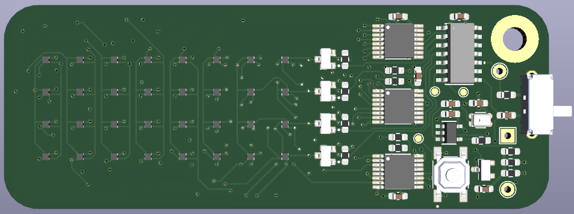
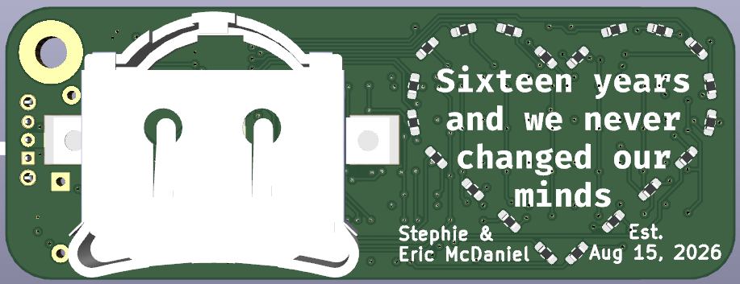
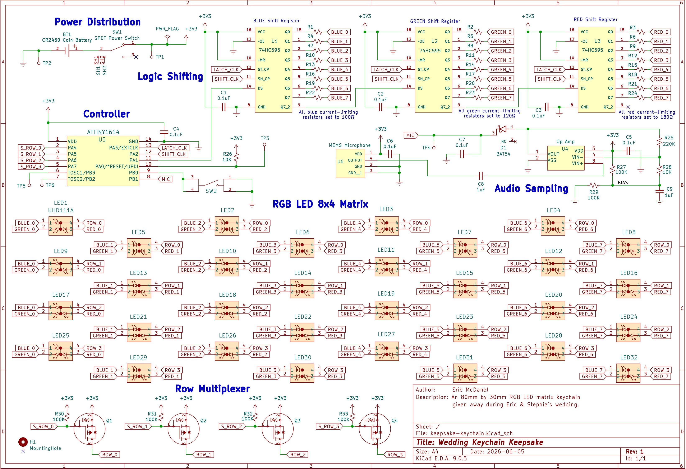
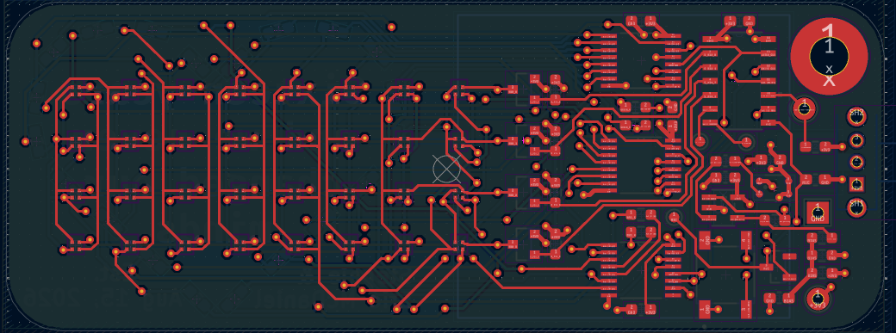
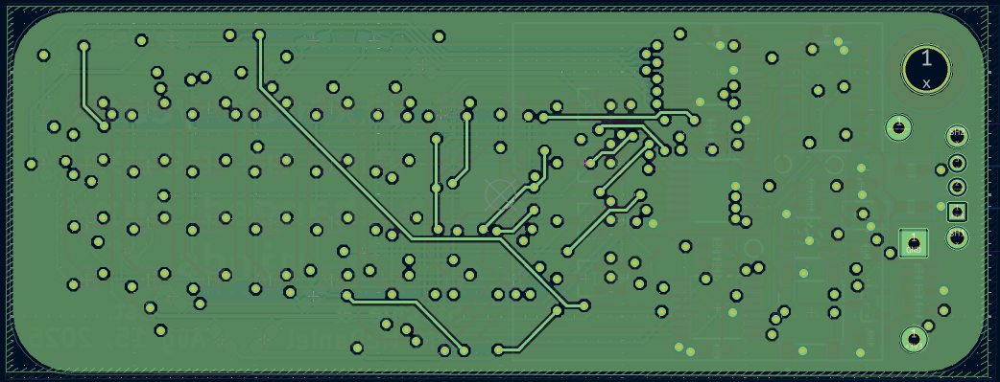
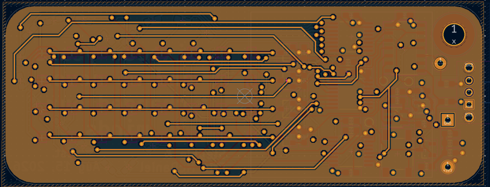
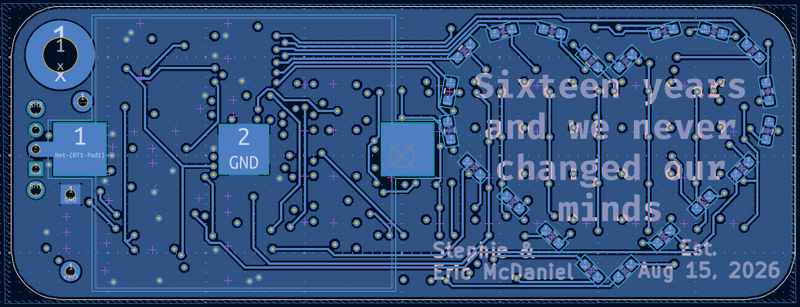

# Wedding Keychain Keepsake

This is the full schematic, design, plans, and source code for the interactive RGB LED keepsake gadget from Eric and Stephie's wedding on Saturday August 15th 2026. These PCBs are attached to a keychain and were distributed to guests as keepsake party favors. The keychain displays a bright grid of LED lights and features simple animations and games.

# Modes

When powered on, the keychain begins in either one of two modes: Animation mode and Game mode. Press and Hold the button for one second to switch between Animation and Game modes.

### Animation Mode

The keychain displays an animation from the selection below. Single-press the button to cycle between animations.
* Tunnel
* Swipe
* Rainbow
* American Flag
* Candle

### Game Mode

As of this writing, the keychain only offers one game named *Dodge*. Dodge is a space-themed endless runner arcade survival game. You are piloting a space shuttle, traveling through the solar system. You encouter space debris, and must evade them before they collide into you.

Single-press the button to steer your rocket in the opposite direction to dodge obstacles. Survive as long as you can, even as you accelerate through the debris at progressively faster rates.

# Bill of Materials

* 32 acrylic-diffused RGB LEDs, arranged in an 8x4 matrix.
* ~~A MEMS microphone and op-amp for simple audio sampling (no FFT).~~
  * This idea was included in the design and was manufactured. The idea was to create additional audio-reactive (and interactive) modes like animations for decibel and music analyzers, but development time exceeded my delivery timeline. This will be revisited later in future updates.
* Animations can be cycled and games that can be played using the single tactile push button.
* Controlled by the AVR-based ATtiny1614 manufactured by *Microchip Technology*.
* Powered by a 24.5mm CR2450 coin cell battery.
* On an 80mm x 30mm PCB with a clam-shell keychain.
* Placed inside a custom-made sled enclosure with snap-fit sliding lid.

# Design

### 3D Rendering

<i>Front side of the PCB</i>

<i>Back side of the PCB</i>

### Electrical Schematic

### PCB Layout

<i>Layer 1 of the PCB (signals/components)</i>

<i>Layer 2 of the PCB (GND)</i>

<i>Layer 3 of the PCB (3V3 copper pour)</i>

<i>Layer 4 of the PCB (Additional signals/components)</i>

# Details

This repository was built using the toolkits provided by PlatformIO, and is based on the Arduino framework (though quite minimally). An RTOS is not used. To keep things as efficient as possible, abstractions that Arduino provides like `digitalWrite()` were replaced with direct register manipulations, particularly duirng hot execution paths. Most notably it is used during the LED rendering logic, which renders each row sequentially for 50μs, creating a multiplex display. The main reason that the Arduino framework is still used is because of how this device uses its timers.

This repo was also built using the custom game engine used in the LumenLab, with a handful of adaptations. This includes the platform-level, core services, the engine, and general architecture from the LumenLab. This repo implements multiplexing manually, so libraries like FastLED could not be used. The keychain runs the main game loop at 60 Hz. Between each frame, the engine multiplexes each row at a frequency of 20 kHz. Between each row rendering, three shift registers designated to the red, green, and blue channels take in a serial stream of bits to indicate signal LOW to turn the LEDs on, and HIGH to turn them off. (Yes, in reverse, because the MOSFETS are active HIGH). PWM to blend all possible colors is achieved by using [bit-angle modulation (BAM)](https://www.desertember.com/posts/bit-angle-modulation.html).

A MEMS microphone and amplifier was included in this board. The goal was realistic, but on an ambitious timeline, so I had to pause that for now. The microphone still remains on the PCB since they were already manufactured. This gives me the opportunity to instead just suspend working on the audio-reactive features rather than cancel entirely.

The goal was to include audio reactivity on the device, which would complement the already interactive animations. Running a full spectrum analyzer was not possible given the microcontroller selected, power constraints, and technical limitations like the inability to timely perform computationally heavy Fast-Fourier Transformations (FFT). The MEMS microphone however was potentially going to sample decibel levels and display a sound-reactive bar. Another idea I had was to make the devices interact with the wedding reception music live in real time by injecting a swift, 20+ kHz logic signal at the start of every song. This chirp wouldn't be heard by humans, but detected by the device. It would then decode the signal, and play an animation or color theme dynamically.

# Development

### Software

The keychain is programmable using the UPDI protocol, which is the newer version of AVR's ISP and JTAG programming. The UPDI (PA0, pin 10) is exposed on a THT test pad, along with 3V3 and GND. To program the device, you need a $6 module called the UPDI Friend - USB Serial UPDI Programmer from [Adafruit](https://www.adafruit.com/product/5879) or [Digikey](https://www.digikey.com/en/products/detail/adafruit-industries-llc/5879/22596413). Releases are provided every PR and can be flashed directly. I'll write instructions for that later (maybe), but if you have the UPDI Friend, the easiest way to update is to compile and flash using the *PlatformIO: Upload (Release)* build script included in this repo.

In addition to the UPDI pin, PB2 (pin 7) and PB3 (pin 6) are mapped to their default of TX and RX respectively. These pins are exposed as SMD test pads. This allows you to probe TX (PB2) to read any serial logs, if you compiled the debug version.

### Hardware

The PCB design files were made using KiCad 9.0.5. The board layout was optimized for the manufacturing capabilities of [PCBWay](https://www.pcbway.com/). Before you start writing me hate mail, know that I'm aware of some of the issues, such as the lack of ESD protection and reverse polarity protection. Perhaps a future revision can include these, but I have no such plans.

The enclosure was made using FreeCAD. They also suck, but I tried. The models were also exported as .3mf files, and were optimized for immediate FDM printing particularly targeting the Bambu Labs A1 Combo. Feel free to adjust as needed. The model includes a sled enclosure which retains the PCB using a friction fit. A lid is applied by sliding from the end using the guide rails. A snap-fit pin is extruded so that the lid locks in place. I printed this using PLA, YMMV.

# AI Disclaimer

AI was consulted as a research and discovery work tool. I asked general design and architecture questions as needed, especially during the board bring-up stage. I don't have a professional background in electrical engineering.

Generative AI however was **not** used to author code. Cheers to all the other crazies out there!