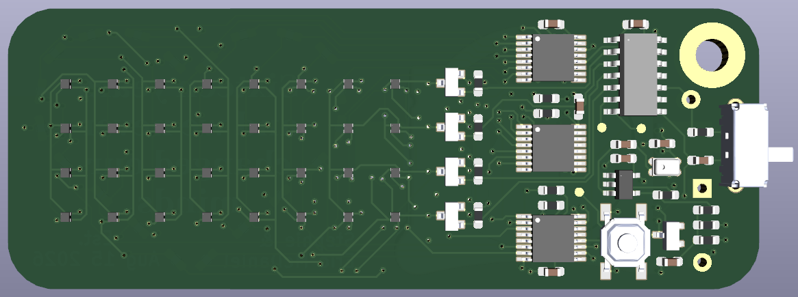
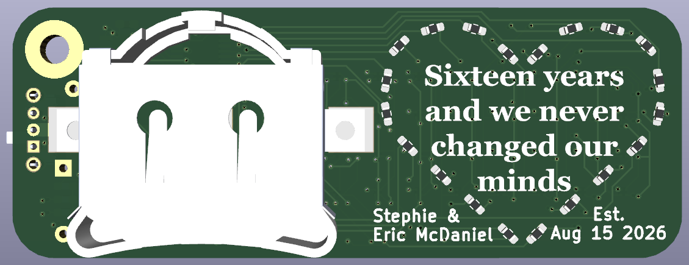
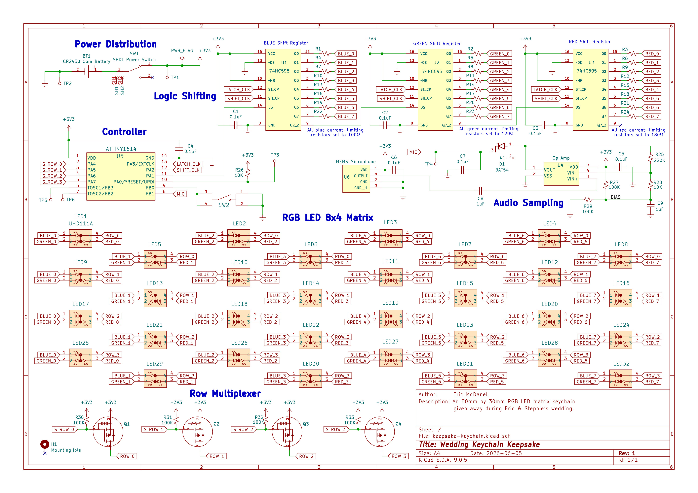
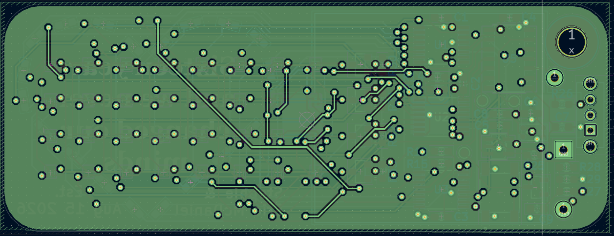

# Wedding Keychain Keepsake

This is the full design and plans for the RGB LED PCB for Eric and Stephie's wedding on August 15th 2026. These PCBs will be distributed to guests as keepsake party favors.

# Features
* 32 acrylic-diffused RGB LEDs, arranged in an 8x4 matrix, to create vivid animations.
* A microphone samples audio and displays an animated volume level meter of the environment.
* Animations can be cycled through with the SMD tactile button.
* Controlled by the ATtiny1614 by *Microchip Technology*.
* Powered by a 24.5mm CR2450 coin cell battery
* All on an 80mm x 30mm PCB the size of a keychain

# 3D Preview

1. Front side of the PCB

2. Back side of the PCB

# Design

Electrical schematic

1. Layer 1 of the PCB (signals/components)

2. Layer 2 of the PCB (GND)

3. Layer 3 of the PCB (3V3 copper pour)

4. Layer 4 of the PCB (Additional signals/components)